<!-- Hand-crafted profile. header.svg & metrics.svg live in this repo — no third-party widget services. -->



<p align="center">
  <b>🟢 Open to Senior Backend / Software Engineer roles — relocating to Amsterdam, NL 🇳🇱 (visa sponsorship)</b><br/>
  <a href="https://www.linkedin.com/in/milad-ahmadi">LinkedIn</a> ·
  <a href="mailto:miladahmadi803@gmail.com">miladahmadi803@gmail.com</a>
</p>

<br/>

## `$ java -jar milad-ahmadi.jar`

```
  .   ____          _            __ _ _
 /\\ / ___'_ __ _ _(_)_ __  __ _ \ \ \ \
( ( )\___ | '_ | '_| | '_ \/ _` | \ \ \ \
 \\/  ___)| |_)| | | | | || (_| |  ) ) ) )
  '  |____| .__|_| |_|_| |_\__, | / / / /
 =========|_|==============|___/=/_/_/_/

 :: Milad Ahmadi ::                       (v9.x.RELEASE — Senior Software Engineer)

INFO  --- [main] MiladApplication           : Starting on JVM 21 (LTS) — profile: production
INFO  --- [main] ExperienceAutoConfiguration: 9+ years of production systems detected
INFO  --- [main] DomainScanner              : Domains found: [fintech, logistics, mobility, e-commerce]
INFO  --- [main] KafkaMeshBean              : 25+ topics wired — exactly-once semantics enabled
INFO  --- [main] SettlementEngine           : Clearing 100K+ trades/day · P99 < 100 ms — SLO met
INFO  --- [main] ReactorPipeline            : Backpressure healthy @ 60K concurrent sessions
INFO  --- [main] ResilienceConfig           : Circuit breakers armed — outage blast radius −60%
INFO  --- [main] GkitPublisher              : OSS toolkits online: [gkit-java, gkit-go, gkit-nestjs]
INFO  --- [main] MentorshipService          : PR review-to-merge −50% · team coverage 85%+
WARN  --- [main] RelocationService          : Instance ready to migrate → eu-west-1 (Amsterdam, NL)
INFO  --- [main] MiladApplication           : Started MiladApplication in 9.2 years (worth every ms)
```



## `$ kafka-console-consumer --topic milad.career.events --from-beginning`

```json
[
  { "offset": 0, "ts": "2017-01", "key": "manage-petro", "value": {
      "role": "Backend Developer", "domain": "fuel-delivery logistics",
      "highlights": ["offline-first CQRS — 1M+ tx/day, 100% data integrity",
                     "Stripe + PSP integrations — GMV +18%"] } },

  { "offset": 1, "ts": "2018-11", "key": "hashthink", "value": {
      "role": "Back-End Engineer", "domain": "web3 / real-time platform",
      "highlights": ["Spring WebFlux + Reactor — 60K concurrent < 150 ms",
                     "event-sourced, idempotent Kafka processors — zero financial mismatches"] } },

  { "offset": 2, "ts": "2020-04", "key": "sanay-systems", "value": {
      "role": "Senior Software Engineer", "domain": "capital markets / fintech",
      "highlights": ["monolith → 40+ Java microservices on EKS — throughput +40%",
                     "settlement engine — 100K+ trades/day · P99 < 100 ms",
                     "GitOps canary deploys — MTTR 40 → 22 min"] } },

  { "offset": 3, "ts": "2025-02", "key": "hich", "status": "CURRENT", "value": {
      "role": "Senior Software Engineer", "domain": "ride-hailing / mobility",
      "highlights": ["event-driven ride & payment platform on Kafka",
                     "PostgreSQL hot-path tuning — p95 −35%",
                     "ClickHouse pipeline — batch reporting → near real-time"] } }
]
```

## `$ helm ls --namespace open-source`

| RELEASE | CHART | STATUS | NOTES |
| :--- | :--- | :--- | :--- |
| **[gkit-java](https://github.com/milad-ahmd/gkit-java)** | `java-21 / spring-boot-3` | ✅ deployed | Production-grade resilience toolkit — retry, circuit breaker, **saga**, caching, validation, observability |
| **[gkit-go](https://github.com/milad-ahmd/gkit-go)** | `go` | ✅ deployed | The Go edition — idiomatic reliability primitives for microservices |
| **[gkit-nestjs](https://github.com/milad-ahmd/gkit-nestjs)** | `typescript / nestjs` | ✅ deployed | Same building blocks for Node services |
| **[spring-boot-enterprise-boilerplate](https://github.com/milad-ahmd/spring-boot-enterprise-boilerplate)** | `java / spring-boot` | ✅ deployed | Opinionated starter — clean architecture & production defaults |

<details>
<summary>&nbsp;<code>application.yml</code> — full skill manifest</summary>

```yaml
milad:
  languages: [java-21, go, typescript, sql]
  backend:
    spring: [boot-3, webflux-reactor, security, data-jpa]
    concurrency: [virtual-threads, executor-service, completable-future]
    go: [net-http, gin, grpc, goroutines, errgroup]
  messaging:
    kafka: { streams: true, connect: true, exactly-once: true }
    also: [rabbitmq, redis-streams, websockets]
  data: [postgresql, mongodb, redis, clickhouse, cassandra, elasticsearch]
  cloud:
    aws: [eks, ecs, lambda, rds, s3]
    platform: [kubernetes, helm, terraform, docker, argocd-gitops]
  testing: [junit5, testcontainers, mockito, gatling, jest, cypress, playwright]
  observability: [prometheus, micrometer, grafana, opentelemetry, elk]
  architecture: [microservices, event-driven, cqrs, ddd, clean-architecture]
  frontend: [react, nextjs, tailwind]   # full-stack range when the product needs it
```
</details>

## `$ curl -s https://milad.dev/v1/contact | jq .`

```json
{
  "name": "Milad Ahmadi",
  "role": "Senior Software Engineer — backend (Java / Go)",
  "location": { "current": "Tehran, IR", "next": "Amsterdam, NL", "visa": "sponsorship-required" },
  "links": {
    "linkedin": "https://www.linkedin.com/in/milad-ahmadi",
    "github": "https://github.com/milad-ahmd",
    "email": "miladahmadi803@gmail.com"
  },
  "status": "open_to_opportunities",
  "response_time_slo": "< 24h"
}
```

<p align="center">
  <a href="https://www.linkedin.com/in/milad-ahmadi"></a>
  <a href="mailto:miladahmadi803@gmail.com"></a>
</p>

---

<p align="center"><sub>⎈ This README is a self-hosted production system: two hand-written animated SVGs, zero external widget dependencies. Uptime guaranteed.</sub></p>
